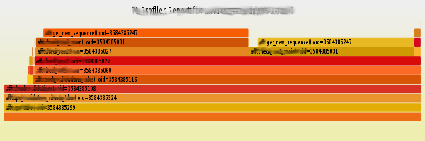
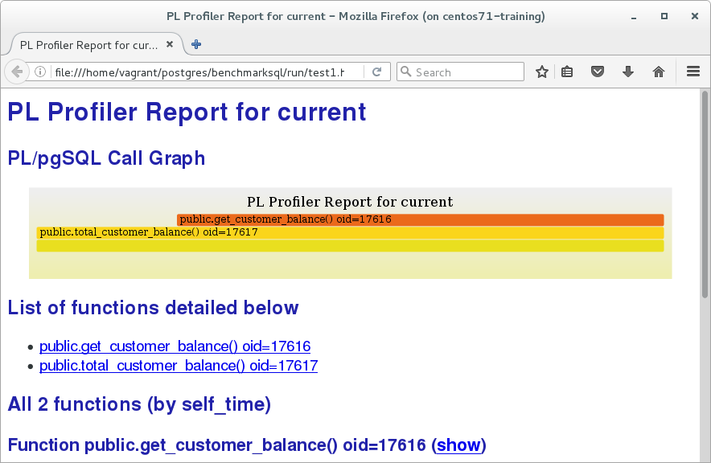
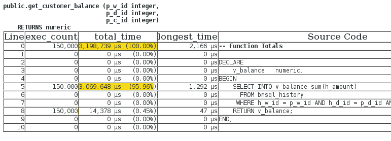
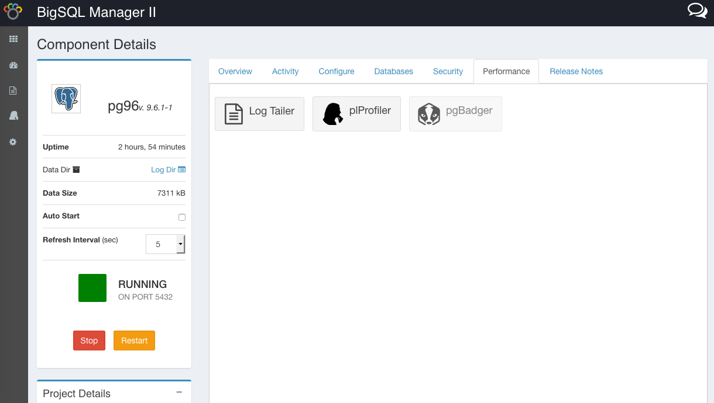
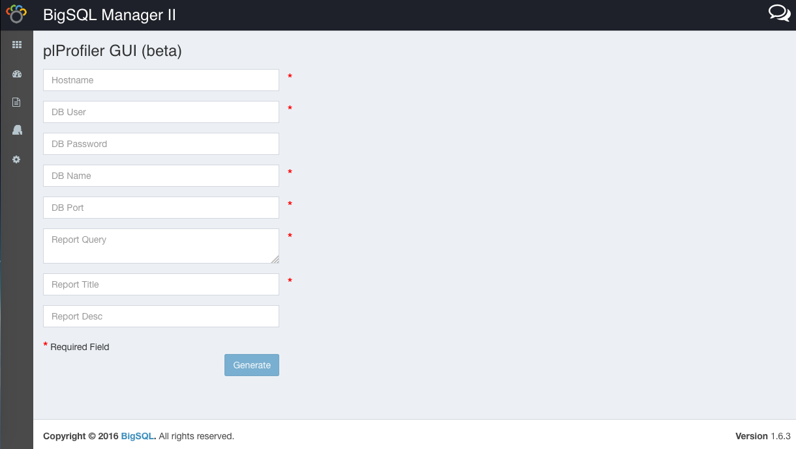
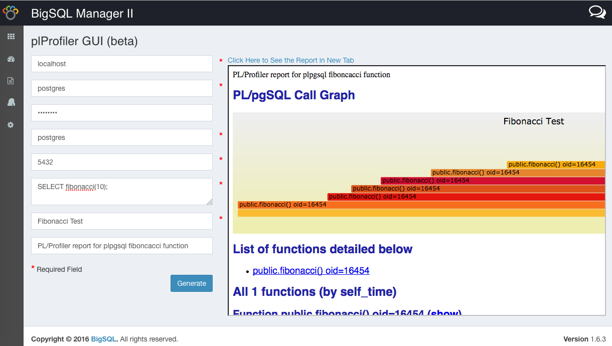

***
# What is Profiling?

[$<]

“In software engineering, profiling ("program profiling", "software profiling") is a form of dynamic program analysis that measures, for example, the space (memory) or time complexity of a program, the usage of particular instructions, or the frequency and duration of function calls. Most commonly, profiling information serves to aid program optimization.”

-- Wikipedia

\pnote{Profiling is analyzing the resource consumption of a program}
\pnote{* CPU time}
\pnote{* Memory consumption}
\pnote{* Disk IO}
\pnote{* Network IO}
\pnote{In the case of PLprofiler we are looking at WALL CLOCK time because that is how that particular part of business logic affected the user experienced response time}

[>$]

***
# Profiling PostgreSQL

[$<]

* PostgreSQL can collect statistics and produce log information that can be used by tools to produce profiles.
* System views based on the statistics collector, like pg_stat_user_tables, show counters per table about the number of sequential scans and index scans, how many tuples have been looked up by scan type, how large the tables are etc.
* The extension pg_stat_statements collects execution statistics for normalized queries.

[>$]

***
# Profiling PostgreSQL

[$<]

* 3rd party products like pgbadger can create extensive reports about which queries consume most of the time and their frequency, tables, indexes and much more.
* Unfortunately pgbadger requires extremely aggressive query logging to be enabled in the postgresql.conf file (log_statement_min_duration=0), which by itself can produce more performance problems when you already have enough.

[>$]

***
# Profiling PostgreSQL

[$<]

* On a side note: very few users perform any profiling before they have a really bad problem in production. 
* This means that once we have a problem, there is no baseline available to compare the current behavior to. How do you tell what is “out of whack” when you don’t know what used to be “normal”?

[>$]

***
# Profiling PostgreSQL

[$<]

* All of this may work to find and tune problematic queries.
* The amount of logging often prohibits doing this in production.

[>$]

***
# How PL/pgSQL works

[$<]

* PL/pgSQL is like every other "loadable, procedural language."
* When a PL function is executed, the fmgr loads the language handler and calls it.
* The language handler then interprets the contens of the pg_proc entry for the function (proargtypes, prorettype, prosrc).

[>$]

***
# How PL/pgSQL works

[$<]

* On the first call of a function in a session, the call handler will "compile" a function statement tree.
* SQL queries in the function are just kept as a string at this point.
* What might look to you like an expression is actually a SELECT query:

[code<]
```

        my_variable := some_parameter * 100;
```
[>code]

[>$]

***
# How PL/pgSQL works

[$<]

* The PL/pgSQL statement tree is very similar to a PostgreSQL parse or execution tree.
* The call handler then executes that statement tree.
* On the first execution of a statement node, that has an SQL query in it, that query is prepared via SPI.
* The prepared plan is then executed for every invocation of that statement in the current session.

[>$]

***
# An Example using PL/pgSQL

[$<]

* The following Example is based on the benchmarksql schema (TPC-C style)
* Like the pgbench schema (TPC-B style), the TPC-C has a HISTORY table without any indexes.
* The main difference is that it has more columns and that the CUSTOMER is identified with a 3-column key.
* If we sum up the history of a customer by selecting directly from the HISTORY table, the query will be logged and accounted for in pg_stat_statements.

[>$]

***
# Let there be a PL/pgSQL function

[$<]

[code<]
```
CREATE FUNCTION get_customer_balance(p_w_id integer,
                                     p_d_id integer,
                                     p_c_id integer)
RETURNS numeric
AS $$
DECLARE
    v_balance   numeric;
BEGIN
    SELECT INTO v_balance sum(h_amount)
      FROM bmsql_history
     WHERE h_w_id = p_w_id
       AND h_d_id = p_d_id
       AND h_c_id = p_c_id;
    RETURN v_balance;
END;
$$ LANGUAGE plpgsql;
```
[>code]

[>$]

***
# And let there be a view using that function

[$<]

[code<]
```
CREATE OR REPLACE VIEW bmsql_problem AS
    SELECT c_w_id, c_d_id, c_id,
           c_balance,
           get_customer_balance(c_w_id, c_d_id, c_id)
               AS sum_history_amount
      FROM bmsql_customer;
```
[>code]

[>$]

***
# The Problem

[$<]

* It is obvious that as the history table is growing over time, the performance of that view will degrade.
* Since the history table does not have an index covering h_w_id, h_d_id, h_c_id, we will see sequential scans on bmsql_history in pg_stat_user_tables.
* But how do we find out where those sequential scans are coming from?

[>$]

***
# What is captured in the logs

[$<]


[>$]

***
# What isn't captured in logs

[$<]


[>$]

***
# We can see them somewhere

[$<]

* `pg_stat_statements.track = all`
* Like with application queries you will see a "normalized" version.
* It is no fun to hunt down that query in thousands of lines of PL code.

* `auto_explain.log_nested_statements = on`
* If you have the disk space for the log and can afford to lose 70% performance.

[>$]

***
# The Problem

[$<]

* You will never see the query
```
SELECT sum(h_amount) FROM bmsql_history ...
```
in the PostgreSQL logs or pg_stat_statements.
* This example is trivial and one could easily find the problem by looking at the view and function.
* In the real world things aren't that simple.

[>$]

***
# In the real world ...

[$<]

* Customer database has 1,800 tables with 13,000 indexes used by 600 PL/pgSQL functions with together over 100,000 lines of code.
* The application is just calling a PL/pgSQL function, which can take anywhere from milliseconds to hours.
* No sequential scans happened.
* Our DBAs had been working on this problem for quite a while.

[>$]

***
# How PL profiler works

[$<]

* plprofiler consists of two things.
    - The plprofiler extension loaded into the backend.
    - The plprofiler command line utility (Python).
* The extension uses the debug instrumentation hooks, added to PostgreSQL in 2006 (8.2).
* The hooks invoke callbacks whenever a function is entered/exited and whenever processing of a PL statement (node) starts/ends.

[>$]

***
# How PL profiler works

[$<]

* Using these callbacks the plprofiler extension collects three different statistics:
    1. Per call stack (call graph) the number of calls, cumulative time spent and cumulative time spent in all children.
    1. Per function the number of calls, the cumulative time spent in all calls to this function and the longest time spent in a single call to this function.
    1. Per statement the same as per function.
* The command line utility is using the extension to collect data and subsequently turn it into a detailed performance profile.

[>$]

***
# What is a call graph?

[$<]

* A call graph is the current stack levels.
* Like a backtrace in a debugger (gdb bt).
* It shows where the program is executing and how it got there.

[>$]

***
# What to do with call graphs?

[$<]

* Call graphs can be turned into something really cool. **FlameGraphs!**
* http://www.brendangregg.com/flamegraphs.html
* This is the first FlameGraph produced from that customer problem.



[>$]

***
# Sorry for the blur

[$<]

* Sorry for the blur, but I could not show you the source code anyway. This was to illustrate how things will look in the real world.
* For a simple example, let us expand on the previous code of get_customer_balance().
* We create another function that returns the total sum of the balances of all customers.

[>$]

***
# Another function

[$<]

[code<]
```
CREATE OR REPLACE FUNCTION total_customer_balance()
RETURNS numeric
AS $$
DECLARE
    v_balance numeric = 0;
    v_cust record;
BEGIN
    FOR v_cust IN SELECT c_w_id, c_d_id, c_id
                    FROM bmsql_customer
    LOOP
        v_balance = v_balance +
                    get_customer_balance(v_cust.c_w_id,
                                         v_cust.c_d_id,
                                         v_cust.c_id);
    END LOOP;
    RETURN v_balance;
END;
$$ LANGUAGE plpgsql;
```
[>code]

[>$]

***
# Let's generate a report

[$<]

* With that in place we execute

[code<]
```
    $ plprofiler run -d bmsql1 \
	    --command "select total_customer_balance()" \
	    --output test1.html
```
[>code]

* This will connect to the database `bmsql1`, activate the plprofiler extension, run the given query and then produce the `test1.html` report.

[>$]

***
# test1.html

[$<]



[>$]

***
# test1.html

[$<]

* By default the report contains details for the top 10 functions by "self time".
* This can be overridden by command line options.
* The details can be viewed by clicking on the (show) link of one of the functions.

[>$]


***
# test1.html

[$<]



[>$]


***
# Other functions of the plprofiler

[$<]

* The plprofiler can not only execute a single function. Instead of using the `--command` option, the `--file` option can be used to execute an entire file full of SQL statements.
* On top of that, version 3 added the ability to profile an entire application.

[>$]


***
# Profiling the whole application

[$<]

* Add plprofiler to shared_preload_libraries.
* Use the plprofiler `monitor` command to capture profiling data into shared memory.
* Use the plprofiler command line utility to generate a report.
* Save the collected data into a permanent set that can later generate a report and/or be exported and imported into another system.

[>$]


***
# How to get it running quickly?

[$<]

* BigSQL (http://bigsql.org) has included plprofiler version 3 in the binary distribution.
* The BigSQL Manager (BAM) has a graphical user interface for plprofiler.

[>$]

***
# plprofiler in BAM

[$<]



[>$]

***
# plprofiler in BAM

[$<]



[>$]

***
# plprofiler in BAM

[$<]



[>$]

***
# That is it (for now)

[$<]

* Questions?

[>$]

***
# SLIDE TITLE

[$<]

* SLIDE CONTENT

[>$]

