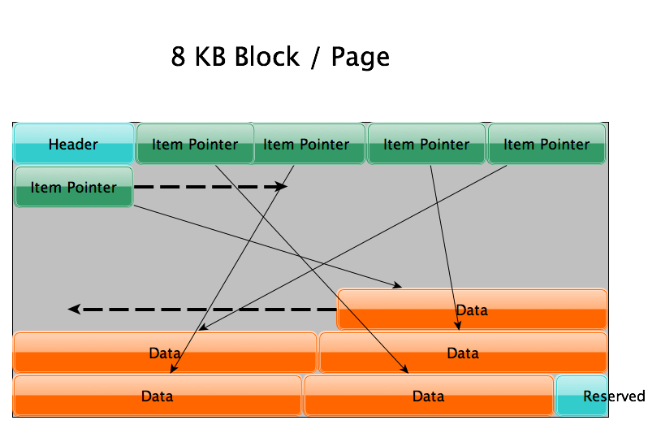
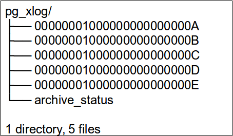

# History

[$<]

* First version was released in 1997	
* Initiated as Ingres project at UC Berkley ( Michael Stonebraker )
* Written in C
* Flexible across all the UNIX platforms , Windows, MacOS and others

* Standard Postgres Sources and Knowledge base
  * [www.postgresql.org](https://www.postgresql.org) – (documentation, release notes and community)
  * PostgreSQL Wiki page
  * PgFoundry for postgres related tools

[>$]

***
# PostgreSQL Lineage

[$<]

[>$]

***
# Database 101

[$<]

* A database stores data

* Text Files work perfectly!
  * Hard to quickly seek through text files
  * Simultaneous updates and reads of the same data?
  * Access control?

* Access the text file via a ‘Management System’ 
  * Traffic cop the data
  * Manage concurrency
  * Provide other ‘features’

[>$]

***
# Database 101

[$<]

* Clients input data into tables ( relations ) in the database and retrieve data from it

* Relational Database Management Systems are responsible for managing the safe-storage of data

* Many enterprise RDBMSs are A.C.I.D. compliant

[>$]

***
# Database 101

[$<]

* ACID
  * Atomicity - Store data in an 'all-or-nothing' approach
  * Consistency - Give me a consistent picture of the data
  * Isolation - Prevent concurrent data access from causing me woe
  * Durability - When I say 'COMMIT;' the data, make sure it is safe until I explicitly destroy it

[>$]

***
# Database 101 - Transactions

[$<]

* A transaction is a unit of work
* It’s all or nothing

  * A Beginning ( BEGIN; ) 
  * Work (INSERTs / UPDATEs / DELETEs / SELECTs)
  * An Ending ( END; ) You would expect one of two cases
    * COMMIT; ( save everything )
    * ROLLBACK; ( undo all changes, save nothing)

Once the transaction has ended, it will either make ALL of the changes between 
BEGIN; and COMMIT; or NONE of them (if there is an error for example)

[>$]

***
# PostgreSQL 101

[$<]

* PostgreSQL meets all of the requirements to be a fully ACID-compliant, transactional database. 

* In order to accomplish this, there are many concepts taken from general database / computer science and implemented 

* The focus of this course will be to show how PostgreSQL accomplishes this internally and the effects that those internals have on end-user functionality

* PostgreSQL RDBMS serves an 'instance'.
    + An instance serves one ( and only one ) TCP/IP port
    + Has a dedicated data-directory
    + Contains at least one database

[>$]

***
# Features

[$<]

* Full network client-server architecture
* ACID compliant
* Transactional ( uses WAL / REDO )
* Partitioning
* Tiered storage via tablespaces
* Multiversion Concurrency Control ( readers don't block writers )
* On-line maintenance operations
* Hot ( readonly ) and Warm ( quick-promote ) standby 
* Log-based and trigger based replication
* SSL
* Full-text search
* Procedural languages 

[>$]

***
# Database Limitations

[$<]

General Database Limitations

|Limit                    | Value
|-------------------------|-----------------
|Maximum Database Size    | Unlimited
|Maximum Table Size       | 32 TB
|Maximum Row Size         | 1.6 TB
|Maximum Field Size       | 1 GB
|Maximum Rows / Table     | Unlimited
|Maximum Columns / Table  | 250-1600
|Maximum Indexes / Table  | Unlimited

[>$]

***
# PostgreSQL Terminology

[$<]

* PostgreSQL was designed in academia
    + Objects are defined in academic terms
    + Terminology based on relational calculus / algebra

Common Database Object Names

|Industry Term                | Postgres Term
|-----------------------------|----------------------------------
|Table or Index               | Relation
|Row                          | Tuple
|Column                       | Attribute
|Data Block                   | Page (when block is on disk)
|Page                         | Buffer (when block is in memory)

[>$]

***
# Client Architecture

[$<]

[>$]

***
# Client Side

[$<]

* Databases are accessed via some sort of client
    + Libraries available for many languages
        - C ( native )
        - C++
        - Java
        - Perl
        - Python
        - etc...
    + Some clients re-use the provided C-api, others ( i.e. JDBC ) implement 
      the protocol natively 

* These clients need to be able to speak to the database

[>$]

***
# Client Side

[$<]

* Connectivity
    + PostgreSQL can be connected to via standard TCP/IP networks.  It has a 
      wire-level protocol commonly referred to as 'libpq'
    + Note: libpq is also the name of the client-side library that implements 
      the protocol

* Language
    + Once connected, you interface with postgres by sending commands to it.  
      The language used is a combination of SQL-99 compliant statements and 
      Postgres maintenance commands.

[>$]

***
# Client Components

[$<]

* Libpq
    + Native (C-based), client-side API 
    + Implements wire-level protocol for server communication

* JDBC
    + Java, client-side API
    + Does not re-use libpq library, implements protocol directly
    + This provides simple use for java users, no need to install the native 
      libpq library 

[>$]

***
# Server Overview

[$<]

* PostgreSQL utilizes a multi-process architecture
* Similar to Oracle's 'Dedicated Server' mode
* Types of processes
    + Primary ( postmaster )
    + Per-connection backend process
    + Utility ( maintenance processes )

[>$]

***
# Server Overview

[$<]

[>$]

***
# Process Components

[$<]

[>$]

***
# Process Components

[$<]

* Postmaster
    + Master database control process
    + Responsible for startup & shutdown
    + Handling connection requests
    + Spawning other necessary backend processes

* Postgres backend
    + Dedicated, per-connection server process
    + Known as a 'worker' process
    + Responsible for fetching data from disk and communicating with the client

[>$]

***
# Server Process Components - Utility

[$<]

* Autovacuum
    + Dedicated backends for providing vacuum services
    + Essentially, a garbage collect of the datafiles
    + Covered later in 'Maintenance' section

* Bgwriter
    + Background writer
    + Flushes memory cache to disk

* Wal-writer
    + Responsible for maintaining transaction log (journal)

[>$]

***
# Server Process Components - Utility

[$<]

* Checkpoint ( 9.2 and higher )
    + This process performs checkpoints
    + < 9.2, this was performed by postmaster

* Archiver
    + Saves WAL files to a specified location for backup purposes
    + Can also be used to achieve replication

* Logger
    + Responsible for writing information logs
    + Errors, warnings, slow running queries, etc...
    + Not used if writing to syslog

[>$]

***
# Memory Components

[$<]

[>$]

***
# Memory Components - Shared Buffers

[$<]

* Shared Buffers is the primary cache component for the server.  It is a segment 
  of memory which stores the disk blocks access from the database files. 
* All the data sets accesses from the disk for the first time are placed in 
  shared buffers so that the subsequent reads will be memory reads.
* All writes are performed in shared buffers.  When a page is modified, it is 
  'dirtied'.  The bgwriter and checkpoint processes will write this out to 
  disk at a later time.
* Shared buffers contain “free buffers” (the buffers which were never used or 
  freed after using) and “dirty buffers” (buffers which are resultant of DML)

[>$]

***
# Memory Components - WAL Buffers

[$<]

* Stores intermediate Write Ahead Log records
* Written on commit by walwriter process ( or when full ) 

[>$]

***
# Per-Session Memory

[$<]

* work_mem
    + Per-Backend sort / hash memory 
    + Used during certain types of JOINs and for ORDER BY operations
    + Set globally, but can be modified per-session

* maintenance_work_mem
    + Used for certain types of maintenance operations ( vacuum, index creation, 
      re-index )
    + Allocated per session that uses it ( i.e. multiple autovacuum workers )

[>$]

***
# On-Disk Components

[$<]

[>$]

***
# Data Directory

[$<]

* All of the on-disk components of a database instance are stored in a 
  data-directory
* This directory contains multiple sub-directories, each of which has a special 
  purpose
* Some sub-directories can be moved by configuration, others by symlink 
  ( unix/linux only )
* Very few of the files are user-readable or modifiable 

[>$]

***
# Data Directory

[$<]

Commonly referred to as $PGDATA

* PG_VERSION
    + Version string of the database instance 
* pg_hba.conf
    + Host-based access control ( built-in firewall)
* pg_ident.conf
    + Ident-based access control 
* postgresql.conf
    + Primary configuration file for the database instance
* postgresql.auto.conf
    + Used by ALTER SYSTEM (9.4+)

[>$]

***
# Data Directory

[$<]

* postmaster.opts
    + What options were used to start the instance
* postmaster.pid
    + The process ID of the instance
* server.crt
    + Server certificate for SSL
* server.key
    + Server private key
* root.crt
    + Trusted certificate authorities

[>$]

***
# On-Disk Components

[$<]

* Datafiles
    + Also referred to as 'relations' or 'base' files
    + Stored in the 'base' directory
    + Contains table or index data
        - Tables have a set of segments
        - Indexes have a set of segments
    + Stored on-disk as 1 gigabyte segments
        - A 5 GB table will be represented on-disk by 5 relation files
        - Segments are automatically added, no intervention required
    + Filled with data in 8kb blocks ( on-disk )  / pages ( in-memory )
        - Blocks and pages are identical, the name is only changed based on 
          where it currently resides

[>$]

***
# base Directory

[$<]

[columns<]

[column=.7]

* Contains the datafiles for your relations
* Under base, there is a sub-directory that identifies each database in the instance
* Under each database subdirectory, there are files that correspond to your relations
* These filenames map to a table's relfilenode 
    + queryable via pg_class
* _fsm and _vm refer to per -table maintenance structures and are discussed later

[column=.3]

[>columns]

[>$]

***
# Block / Page Layout

[$<]

* Each 1 GB datafile ( or relation ) is made up of 8 KB blocks
    + 8 KB is change-able at compile time 

* Blocks ( on disk ) and pages ( in memory ) are identical
    + Page Header ( 20 bytes )
    + Item pointers 
        - An array of pointers to the actual data in the page
        - Filled from the front to the back 
    + Data 
        - Filled from the rear of the page towards the front
    + Free space
        - Between item pointers and data
    + Reserved section
        - Used primarily for index pages

[>$]

***
# On-Disk Components

[$<]

[>$]

***
# On-Disk Components

[$<]

* Write Ahead Log (WAL) Files
    + This is the transaction journal 
    + Also known as: WAL, xlog, pg_xlog, transaction log, journal, REDO
    + These files contain a record of a transaction that is persisted to disk when a client COMMITs
    + The database does not return success to the client until this is safely persisted to disk
    + If a crash takes place, this journal can be used to reconstruct all transactions
    + These files are written by the walwriter process

[>$]

***
# pg_xlog Directory

[$<]

[columns<]

[column=.7]

* Contains active WAL segments
* Segments are recycled after time
* Segments are fixed at 16 MB
* Can be changed at instance 'init' time
* Variable number of files
    + checkpoint_segments (< 9.5)
    + max_wal_size             (  9.5+)
* Move pg_xlog (symlink) to dedicated disk

[column=.3]

[>columns]

[>$] 

***
# On-Disk Components

[$<]

* Archived Logs
    + Archived versions of the WAL
    + An archived log has the same format as a non-archived log, it is just kept 
      in a [ user-defined ] directory other than pg_xlog
    + After a WAL file is closed, the 'archiver' process will perform the archive 
      operation on it
        - Essentially, just a 'cp' or 'rsync'
        - Command is user-definable in postgresql.conf
    + Archiving can be enabled or disabled

[>$]

***
# On-Disk Components

[$<]

[columns<]

[column=.7]

* Global Area
    + Shared catalogs
    + System views
    + Control file
    + Can be accessed across databases
    + Cannot be modified except under special circumstances

[column=.3]

[>columns]

[>$]

***
# In-Motion

[$<]

* How is this better than a text file?
    + Accept client requests and operate on them
    + Ensure that the data is safe on storage
    + Enforce A.C.I.D.
* Let's see some examples of how the architecture supports these two equally 
  important goals

[>$]

***
# Connect Request

[$<]

[columns<]

[column=.3]

1. A client connection is sent to the postmaster
2. Authentication is performed 
3. The postmaster spawns a user-backend process
4. The user-backend calls back to the client to continue operation

[column=.7]

[>columns]

[>$]

***
# Reading Data

[$<]

[columns<]

[column=.5]

1. The client issues a query, the user-backend performs the read
2. If the data is in cache shared_buffers, it is a memory read

[column=.5]

3. If not, the user-backend reads from the data files
4. The user-backend copies the data to shared_buffers
5. The data is returned to the client

[>columns]

{ height=35% }

[>$]

***
# Writing (or deleting) Data

[$<]

[columns<]

[column=.5]

1. Client issues write request
2. User-backend checks for data in shared_buffers
3. If not, reads into  shared_buffers
4. User-backend modifies ( dirties ) data in shared_buffers

[column=.5]

5.  User-backend records transaction in WAL
6. On commit,  walwriter commits wal_buffers to pg_xlog ( on disk ) 
7. After some time, bgwriter ( clock sweep) or checkpoint (forced) writes 
   dirtied buffers to disk

[>columns]

{ height=30% }

[>$]

***
# MVCC

[$<]

* Maintain data consistency internally
* While querying a database each transaction sees a snapshot of data (a 
  database version) as it was some time ago
* Prevent transaction from viewing inconsistent data
* Provides transaction isolation in concurrent transactions
* Readers does not block writers and writers does not block readers

[>$]

***
# Logical Layout

[$<]

[columns<]

[column=.6]

* PostgreSQL has a very 'filesystem' like layout internally
* Logical structures may or may not tie to physical structures
* Layout is controlled by the postgres catalog tables (pg_catalog)

[column=.3]

[>columns]

[>$]

***
# Logical-Physical Mappings

[$<]

* Instance 
    + Ties to a directory ( data directory )
    + 1-1 tcp/ip port
    + 1 postmaster
    + 1 shared_buffers
* Database
    + Multiple databases per instance
    + Each database maps to a directory under 'base' in the instance's 
      data-directory
* Schema / namespace
    + Purely logical grouping of relations ( tables and indexes ) 
    + A schema only exists In the catalogs, has no real physical structure

[>$]

***
# Logical-Physical Mappings

[$<]

* Tablespaces
    + A directory on disk where postgres can store relations
    + Used for tiering storage
* Users
    + Can be assigned across databases
    + Do not have physical structure ( other than in catalogs )
 
[>$]

***
# Lab Exercise 1

[$<]

* Open your VM
* Login as vagrant (password: vagrant)
* Install the RPM
    + /home/vagrant/postgres

[>$]

***
# Lab Exercise 2

[$<]

* Initialize the postgres instance
    + Follow the on-screen prompts
* Find the data directory and look at the files / folders contained within
    + /opt/postgres/

[>$]

***
# Lab Exercise 3

[$<]

* Visualize running postgres on the system
    + list the postgres processes
* Note: The postmaster
* Note: The utility processes

[>$]

