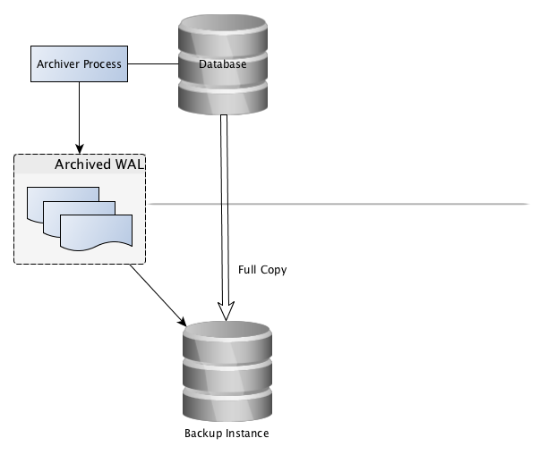

# Backup and Recovery

[$<]

####Postgres has two primary styles of backup:

* Logical 
	* Uses MVCC to generate a consistent, logical backup of data from inside the database

* Physical
	* Uses WAL to generate a consistent, file-level backup of the data-directory

[>$]

***

# Logical Backups

[$<]

####Pros:

* Portable across platforms
* User-modifiable
* Selective backup / restore of tables ( depending on opts)

####Cons:

* Performs a full query of all tables being backed up
* Longer time to restore ( index builds ) 
* No incremental / differential options

[>$]

***

# Logical Backups

[$<]

####Logical backups are taken using a utility called pg_dump:

* pg_dump & pg_dumpall found in the bin directory

* pg_dump performs a logical dump of the data : 
	* METADATA, ROWS, GRANTS and NODATA objects like functions, views, triggers, rules

* pg_dump can be performed at Table level, schema level, Database level, instance level and metadata level – In-short a snapshot of the objects will be taken

[>$]

***

# pg_dump

[$<]

####pg_dump Options

	-a 			- Data only.  Do not dump the data definitions (schema)
	-s 			- Data definitions (schema) only. Do not dump the data
	-n <schema> - Dump from the specified schema only
	-t <table> 	- Dump specified table only
	-f <file>    	- Send dump to specified file
	-Fp 			- Dump in plain-text SQL script (default)
	-Fd 			- Dump in directory format
	-Fc 			- Dump in compressed, custom format
	-v 			- Verbose option
	-o 			-use oids

[>$]

***

# pg_dump

[$<]

• Pg_dump and pg_dumpall binaries can be found in postgres bin directory

• pg_dump --help

	pg_dump –p 5432 -t pgbench_accounts -f  /tmp/pgbench_accounts.sql gnb

[>$]

***

# pg_dump

[$<]

####pg_dump has multiple backup modes:

* Plaintext
	* This will generate a plain SQL file of the requested objects and data
	* Simple to manually modify data
	* Adds white space overhead to data ( can be larger than the actual database ) 

* Compressed
	* Generates a compressed and indexed backup file of the requested objects
	* Proves 'selective' restoration.  With the index, you can choose to only restore certain objects or their data
	* Usually slower to create and restore
	* Requires the use of the pg_restore executable

* Directory
	* Stores backup in a directory
	* used for ‘parallel backup’ feature (-j)

[>$]

***

# pg_dumpall

[$<]

####pg_dumpall Options
	
pg_dumpall is designed to dump the full contents of an entire database instance to a plain text file (no other formats available).  
 
	-a – Data only.  Do not dump the data definitions (schema)
	-s - Data definitions (schema) only. Do not dump the data
	-g  - Dump global objects only – i.e., users and groups
	-v – Verbose option

[>$]

***

# Restoring

[$<]

####Plain backups

* use psql 
* use any SQL processor (pgAdmin, etc…)
* psql -f mybackup.sql postgres
* -f <filename>
* database name
* files are plain text and portable

####Custom format, directory format, etc…
* use pg_restore
* Files are portable across architectures
* Syntax:
* pg_restore [options…] [filename.backup]

[>$]

***

# pg_restore

[$<]

####pg_restore options

	-d <database name> - Connect to the specified database. Also restores to this database if –C option is omitted
	-C – Create the database named in the dump file & restore directly into it
	-a – Restore the data only, not the data definitions (schema)
	-s – Restore the data definitions (schema) only, not the data
	-n <schema> - Restore only objects from specified schema
	-t <table> - Restore only specified table
	-j <jobs> - Parallelize the restore
	-v – Verbose option

[>$]

***

# SQL Dump

[$<]

* pg_dumpall is used to dump an entire database cluster in plain-text SQL format
* Dumps global objects - user, groups, and associated permissions
* Use PSQL to restore

Syntax:

	pg_dumpall [options…] > filename.backup

[>$]

***

# Restore – SQL Dump

[$<]

 
Syntax:

	psql –d template1 < filename.sql
or

	psql –d template1 –f filename.sql
 
Any database in the cluster can be used for the initial connection – it doesn’t have to be template1

[>$]

***

# Physical Backups

[$<]

Copy of the instance's data directory
 
The simplest form of a physical backup is:

* Stop the PostgreSQL instance
* zip -r backup_data.zip /path/to/pgdata
 
[>$]

***

# Physical Backups

[$<]

* Backups requiring downtime aren’t very useful

* By using WAL archiving, we can take physical backups while online (hot backup)

* This system is the basis for Point-in-Time recovery, Hot-Standby, Streaming replication, etc... 

[>$]

***

# Physical Backups

[$<]

####Pros
* All objects backed-up every time
* Point-in-Time recovery available
* Ultra-fast restore

####Cons
* Not portable across platforms
* More complicated procedures
* Requires log archiving be rock-solid

[>$]

***

# Physical Backups - Concept

[$<]

[>$]

***

# Archiving

[$<]

1. Create a location to archive logs
1. Enable archiving
1. Validate archiving
1. Enable backup mode
1. Copy $PGDATA
1. Disable backup mode
1. Create recovery.conf  
	a. Point copy of instance to archived logs
1. Start copy of the instance  
	b. It will replay the necessary log files until consistent

[>$]

***

# Archiving

[$<]

Prior to taking any physical backup with the instance running, archiving must be enabled:

	mkdir /archive
	chown postgres /archive

Edit the postgresql.conf file:

* set the archive_mode=on
* “archive_command” parameter

Unix:

	archive_command= ‘cp –i %p /archive/%f ’ 

Windows:

	archive_command= 'copy "%p" c:\\mnt\\server\\archivedir\\"%f"' 
 
%p is absolute path of WAL otherwise you can define the path   
%f is a unique file name which will be created on above path. 

[>$]

***

# Physical Backups – Backup mode

[$<] 

To start the backup process, the following command needs to be issued by connecting to the PostgreSQL instance:

	select pg_start_backup(‘my backup’);

* Performs checkpoint
* Create a backup_label
* Force an xlog switch 

[>$]

***

# Physical Backups – Copy Data

[$<] 

Copy the data directory:

	cp -Rp /data /home/dev_postgres/data_backup
	rsync -avzP /data ...
 
Use any tool that you would like for this:

* cp, rsync, copy.exe, robocopy.exe
* Filesystem-level snapshots ( zfs, lvm, btrfs)
* Storage-level snapshots, (RecoverPoint, SRDF)

[>$]

***

# Physical Backups – Backup mode

[$<]

Stop backup mode:

	select pg_stop_backup();

* Removes backup_label 
* Performs xlog switch

[>$]

***

# Point-in-Time Recovery (PITR)

[$<]

* Point-in-time recovery (PITR) is the ability to restore a database cluster up to the present or to a specified point of time in the past

* Uses a full database cluster backup and the write-ahead logs found in the /pg_xlog subdirectory

* Must be configured before it is needed (write-ahead log archiving must be enabled)

[>$]

***

# Point-in-Time Recovery

[$<] 

Make a base backup
 
1. Connect using psql and issue the command:

		SELECT pg_start_backup(‘my label’);

2. Backup the $PGDATA directory

3. Connect using psql and issue the command:

		SELECT pg_stop_backup();
 
[>$]

***

# Point-in-Time Recovery

[$<] 

* Remove all existing files in the $PGDATA directory and subdirectories 
	* Ensure you have backed up all configuration files and SSL certificates
	
* Restore the database files from the backup
* Set the approriate permissions on the files (700 for the postgres user)
* Copy any unarchived WAL files into the pg_xlog directory
* Create a recovery.conf file in the $PGDATA directory
* Restart the database server

[>$]

***

# Point-in-Time Recovery

[$<]

Settings in the recovery.conf file

	restore_command(string)

Unix:

	restore_command = 'cp /mnt/server/archivedir/%f "%p"‘

Windows:
	
	restore_command = 'copy c:\\mnt\\server\\archivedir\\"%f" "%p"' 
 
* recovery_target_time(timestamp)
* recovery_target_xid(string)
* recovery_target_inclusive(boolean)

[>$]

***

# Physical Backup Management Utilities

[$<]

* pgBackRest

* OmniPITR

* pg-rman

* PgBarman

* Repmgr

* WAL-E

[>$]

***

# Lab Exercise 1

[$<]

Background: Your database is ready to move from test and development into production. Configure your database to reduce the chances of failure or data loss.

Tasks:

* Setup WAL archiving.
* Run an online backup.
* Restore that backup.

[>$]

((

See previous slides

))

***

# Lab Exercise 2	

[$<]

We need to clone the gnb database as gnb_qa

* Create a gnb_qa database
* Take a backup of the gnb database
* Restore the backup to the new, qa database

( Hint: pg_dump / pg_restore / pg_dumpall )
 
[>$]

((

	$ psql
	psql (9.3.5)
	Type "help" for help.
	
	postgres=# create database gnb_qa;
	CREATE DATABASE
	postgres=# \q
	
	$ pg_dump -Fc gnb > gnb.bak
	
	$ pg_restore -d gnb_qa gnb.bak
	]
	$ psql gnb_qa
	psql (9.3.5)
	Type "help" for help.
	
	gnb_qa=# \dt+
	                           List of relations
	 Schema |       Name       | Type  | Owner  |    Size    | Description
	--------+------------------+-------+--------+------------+-------------
	 public | pgbench_accounts | table | scottm | 13 MB      |
	 public | pgbench_branches | table | scottm | 8192 bytes |
	 public | pgbench_history  | table | scottm | 8192 bytes |
	 public | pgbench_tellers  | table | scottm | 8192 bytes |
	(4 rows)
	
	gnb_qa=#

))

***

# Lab Exercise 3	

[$<]

* GNB needs another copy of the database restored to a new instance

* Restore the backup of the gnb database to the instance running on port 5432

[>$]