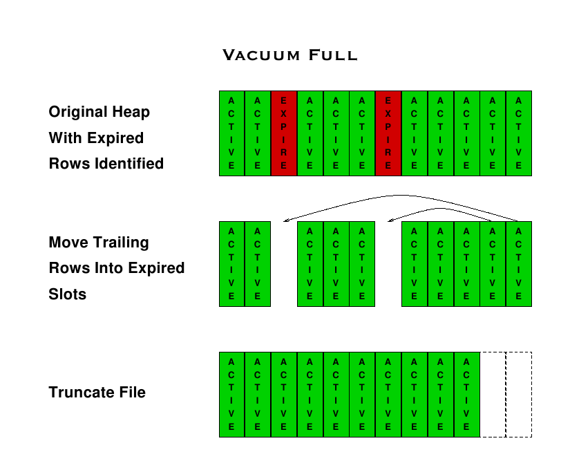

# Situations

[$<]

There are multiple situations that can occur in a database.  Maintenance is necessary in order to prevent them.

* Fragmented / bloated tables & indexes
* TransactionID ( XID ) Wrap-Around
* Out of Date query plans
* Unbalanced Indexes
* Index Utilization

[>$]

***

# Fragmentation / Bloat

[$<]

* A side-effect of the PostgreSQL MVCC system is that 'dead' space will be left in the table and indexes after UPDATE and DELETE statements

* If maintained properly ( and the workload permits ) this can be reused by other updates

* Takes up disk space, unnecessarily 

* Bloat can cause performance problems 
	* Can be felt in INSERT / UPDATE / DELETE and SELECT

[>$]

***

# Finding Bloat

[$<]

* Estimates are usually good enough to determine the troublesome tables
	* Table Bloat Query (https://wiki.postgresql.org/wiki/Show_database_bloat)
	* pgstattuple_approx

* More exact methods are available, but rarely does the extra overhead justify to precision
	* pgstattuple

[>$]

***

# Finding Bloat (cont.)

[$<]

	CREATE EXTENSION pgstattuple;
	
	SELECT * FROM pgstattuple_approx('pgbench_accounts');
	
	-[ RECORD 1 ]--------+-----------------
	table_len            | 135340032
	scanned_percent      | 45
	approx_tuple_count   | 999981
	approx_tuple_len     | 127414265
	approx_tuple_percent | 94.1438117880746
	dead_tuple_count     | 0
	dead_tuple_len       | 0
	dead_tuple_percent   | 0
	approx_free_space    | 2693908
	approx_free_percent  | 1.99047389023818

[>$]

***

# What is xid Wraparound?

[$<]

* PostgreSQL's MVCC transaction semantics depend on being able to compare transaction ID (XID) numbers

* A row version with an insertion XID greater than the current transaction's XID is "in the future" and should not be visible to the current transaction 

* Transaction IDs have limited size (32 bits) an instance that runs for a long time (more than 4 billion transactions) would suffer transaction ID wraparound

* The XID counter wraps around to the starting point (integer 4 < 9.6, freeze bit in 9.6+), and all of a sudden transactions that were in the past appear to be in the future — which means their output become invisible.

[>$]

***

# Finding xid Wraparound

[$<]

It is better to find troublesome tables early so they can be handled during planned maintenance periods instead of PostgreSQL automatically doing it.

	SELECT relname, age(relfrozenxid) as xid_age
	  FROM pg_class c, pg_namespace n  
	 WHERE c.relnamespace = n.oid
	   AND n.nspname = 'public'
	   AND relkind = 'r';

[>$]

***

# Data Statistics

[$<]

* PostgreSQL uses a cost-based optimizer to generate query plans in order to execute on them.

* Each operation in a query plan is given a cost, this is provided by table and index statistics.  Each method of executing the query ( hash join vs. merge join, index scan vs. sequential scan, etc... ) are compared and the lowest-cost option is selected.

[>$]

***

# Explain and Explain Analyze

[$<]

Explain will show you the expected execution plan and costs for the query.

	postgres=# \timing
	Timing is on.
	postgres=# explain select * from foo where id >= 35 and id < 1000;
	                            QUERY PLAN
	------------------------------------------------------------------
	 Index Scan using i on foo  (cost=0.00..37.10 rows=887 width=36)
	   Index Cond: ((id >= 35) AND (id < 1000))
	(2 rows)
	 
	Time: 0.344 ms

[>$]

***

# Explain and Explain Analyze

[$<]

* Explain Analyze will show you the expected execution plan and costs as well as the actuals

* This will execute the query, but not provide the actual results

		postgres=# explain analyze select * from foo where id >= 35 and id < 1000;
		                           QUERY PLAN
		-------------------------------------------------------------------------------
		 Index Scan using i on foo  (cost=0.00..37.10 rows=887 width=36) (actual time=0.124..0.441 rows=965 loops=1)
		   Index Cond: ((id >= 35) AND (id < 1000))
		 Total runtime: 0.519 ms
		(3 rows)
		 
		Time: 0.942 ms
	 
[>$]

***

# Age of Statistics

[$<]

* Depending on the turnover of the data in a table, the statistics may get stale very quickly
* The meaning of age is very dependent on the application

		SELECT relname, last_analyze,
		       last_autoanalyze 
		  FROM pg_stat_user_tables;

[>$]

***

# Updating table statistics

[$<]

These can be updated manually by running the 'ANALYZE' command.

	postgres=# \h ANALYZE
	Command:     ANALYZE
	Description: collect statistics about a database
	Syntax:
	ANALYZE [ VERBOSE ] [ table [ ( column [, ...] ) ] ]
 
[>$]

***

# Vacuum

[$<]

* Vacuum marks 'dead' space left by MVCC in blocks (tables and indexes) as available for re-use

* UPDATEs can take advantage of the available space

* Vacuum itself does not reclaim disk space
	* That is done with either vacuum full (offline), cluster (offline) or 'pg_repack'  (online, but external project)

* Vacuum scans a whole table 

[>$]

***

# Vacuum Modes / Options

[$<]

Default, vacuums the table and all associated index, looks for free space and marks it in the FSM:

	VACUUM [table];

Same as above, but, performs a statistical analysis as well:

	VACUUM ANALYZE [table];

Same as above, but, initiates freeze operation. Resets xmin to '2':

	VACUUM ANALYZE FREEZE [table];

[>$]

***

# Vacuum Modes / Options

[$<]

Same as above, but, prints vacuum stats:

	VACUUM ANALYZE VERBOSE [table];

WARNING: Fully locks the table and performs space reclamation / compaction:

	VACUUM FULL ANALYZE VERBOSE [table]

[>$]

***

# Autovacuum

[$<]

* Vacuum can be run manually, but it is recommended to run the autovacuum daemon ( default ) to handle vacuuming automatically

* Autovacuum has a launcher process ( utility process ) that manages autovacuum workers

* Autovacuum workflow
	* Wake-up
	* Look for a table that has hit certain thresholds
	* Vacuum that table
	* Sleep

[>$]

***

# Autovacuum

[$<]

####Capable of all modes (except FULL)

Configurable number of background workers:

	autovacuum_max_workers

Autovacuum can be throttled: 

	autovacuum_vacuum_cost_delay

Control when a FREEZE takes places:

	autovacuum_freeze_max_age

[>$]

***

# Autovacuum Starvation

[$<]

* Autovacuum works based on thresholds
	* Number of changes to a table
	* pg_stat_user_tables
		* n_tup_upd, n_tup_del

* If a table is receiving ultra-high volume changes, it would effectively hit the top of the 'hit-list' for autovacuum each time it runs

* This effectively drops your 'max_workers' by one

[>$]

***

# Dealing with starvation

[$<]

* Modify global thresholds 
	* postgresql.conf
	* Typically not preferred, especially if only 1 or 2 tables are causing issues

* Modify thresholds, per-table
	* ALTER TABLE…

* Increase max_workers 
	* By the number of nasty tables you have

* Disable autovacuum, run an outside job for vacuum

		psql -d gnb -c “VACUUM VERBOSE pgbench_branches”

[>$]

***

# Per Table Thresholds

[$<]

The default values controlling autovacuum are adequate for most tables, but some need more aggressive settings

	ALTER TABLE foo SET (autovacuum_vacuum_scale_factor = 0.05);

[>$]

***

# Per Table Thresholds

[$<]

[>$]

***

# Routine Reindexing

[$<]

* In some situations it is worthwhile to rebuild indexes periodically with the REINDEX command.

* Index pages that have become completely empty are reclaimed for reuse, but the potential for bloat is not indefinite.

* REINDEX will lock the table

		REINDEX { TABLE | DATABASE | INDEX } name [ FORCE ]

[>$]

***

# Minimize Reindex Locking

[$<]

	cat index_build.sql
	-------------------------------------------------
	CREATE INDEX CONCURRENTLY people_lName_idx_new ON people (id, lname);
	
	BEGIN; 
	DROP INDEX people_lName_idx; 
	ALTER INDEX people_lName_idx_new RENAME TO people_lName_idx; 
	COMMIT;
	-------------------------------------------------
	
	psql -d postgres -U postgres -f index_build.sql

[>$]

***

# Unused Indexes

[$<]

Indexes add overhead for every INSERT and UPDATE
If the index does not enforce a constraint and is not used, it should be removed.

	SELECT relname,indexrelid, idx_scan
	   FROM pg_stat_user_indexes 
	  WHERE idx_scan = 0;

[>$]

***

# Log Removal

[$<]

* Not WAL / xlog

* Not the Commit Log / pg_clog

* Just remove files from pg_log

* The log file name may allow for log files to build up over time
	
		log_filename = 'postgresql-%Y-%m-%d_%H%M%S.log

[>$]

***

# Lab Exercise 1	

[$<]

* Run pgbench against the gnb for 10 clients and 1000 transactions per client

		pgbench -s 100 -c 10 -t 100 gnb

* Create an explain plan for following queries

		select * from pgbench_accounts where aid = 1
		select * from pgbench_accounts where aid > 1
 
* What is the difference between the explain plans?

[>$]

***

# Lab Exercise 2	

[$<]

* Determine which tables are the most bloated and which tables have no bloat.

[>$]

***

# Lab Exercise 3	

[$<]

* Write a statement to vacuum the whole database including all tables. Make sure to save detailed vacuum information.

* The pgbench_branches table is heavily used in dml operations which results in lots of obsolete rows in the table. Execute a command to remove all such rows.

[>$]

((

1:
psql -d gnb

gnb=# VACUUM VERBOSE ;

2:
  VACUUM FULL VERBOSE ANALYZE pgbench_branches;

))

***

# Lab Exercise 3	

[$<]

* The GNB website database is a heavily transactional database and it requires a periodic full vacuum to run.
	* How would you use psql and cron to accomplish this task ? 
	* Test your psql command to validate that it works without user interaction

[>$]

((

NB: Have them set env vars.. even PGPASSWORD if needed 

Method 1: 

Make a file: maint.sql 
  Contents:
     VACUUM FULL VERBOSE ANALYZE;

psql -d gnb -p … -f maint.sql

Method 2: 

psql -d gnb -p … -c “VACUUM FULL VERBOSE ANALYZE”

))

