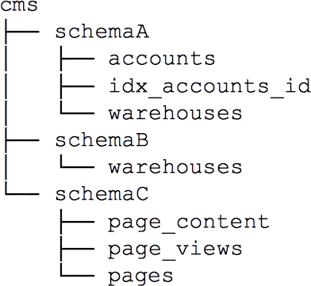

# Connecting to Postgres

[$<]

* Required parameters to connect
    + Instance
        - Tcp/ip address
        - Tcp/ip port
    + Database
        - Name of a valid database
    + User
        - Name of a valid user with LOGIN privilege to the named database

[>$]

***
# Creating & Managing Postgres Instances

[$<]

* An instance is created with initdb
    + Bootstraps a fresh catalog
    + Copies default config files
    + Leaves a populated data-directory, but a non-running instance
        - `initdb -D /data`

* Should be run as the user that will own the DB server processes
    + Default superuser will be named after
    + The value of PGUSER
    + The OS user that ran initdb

[>$]

***
# initdb --help

[$<]  

	$ initdb --help
	initdb initializes a PostgreSQL database cluster.

	Usage:
  		initdb [OPTION]... [DATADIR]

	Options:
 		-A, --auth=METHOD         default authentication method for local connections
      		--auth-host=METHOD    default authentication method for local TCP/IP connections
      		--auth-local=METHOD   default authentication method for local-socket connections
 		[-D,--pgdata=]DATADIR     location for this database cluster
  		-E, --encoding=ENCODING   set default encoding for new databases
  			--locale=LOCALE       set default locale for new databases
      		--lc-collate=, --lc-ctype=, --lc-messages=LOCALE
      		--lc-monetary=, --lc-numeric=, --lc-time=LOCALE
								  set default locale in the respective category for 	new databases (default taken from environment)
      		--no-locale           equivalent to --locale=C
      		--pwfile=FILE         read password for the new superuser from file
		-T, --text-search-config=CFG
                            default text search configuration
  		-U, --username=NAME       database superuser name
  		-W, --pwprompt            prompt for a password for the new superuser
  		-X, --xlogdir=XLOGDIR     location for the transaction log directory
  
[>$]

***

[$<] 

# Creating & Managing Postgres Instances

* Once created, start the instance

		pg_ctl -D /data start

* Once started, connect

		psql postgres 

[>$]

***

[$<] 

# Creating & Managing Postgres Databases

### Databases

* Created with the 'create database' command  

		create database testing;

### Schemas (namespaces)

* Created with 'create schema' command  
* Tables can be created / accessed via 'schema.table'

### Databases are connected to, schemas can be accessed 
* Schemas within a database have an ordered PATH called search_path in which they are searched
* See example

[>$]

***

[$<] 

# Schema search_path

When fully-qualified table names are not used, the system uses the search_path to resolve the given relation names

### In the example, we have 3 schemas in the same database

	search_path=schemaA,schemaC
	select * from warehouses;

The resolved table will be schemaA.warehouses

	search_path = schemaC, schemaB
	select * from warehouses;

The resolved table will be schemaB.warehouses;
 
	search_path=schemaC;
	select * from warehouses;

No relation called 'warehouses' found
 
###If full-qualification is used, the search_path is ignored 

	search_path=schemaC
	select * from schemaB.warehouses;

[>$]

***

[$<] 

# Users

* Database users are different than operating system users

* Users can be created in SQL using “CREATE USER” command or using the “createuser” utility.  

		CREATE USER scottm PASSWORD ‘PostgreSQL’;
		CREATE USER scottm_dba CREATEDB CREATEUSER;
		CREATE USER scottm_temp VALID UNTIL ‘2017-08-31’;
		DROP USER scottm CASCADE;

[>$]

***

[$<] 

# Groups

* Similar to groups in Unix

* Can be granted permissions like users

		CREATE GROUP dba_group WITH USER scottm_dba;
		CREATE GROUP temp_users;
		ALTER GROUP temp_users ADD USER scottm_temp;
		DROP GROUP temp_users;

[>$]

***

[$<] 

# Roles

* A role can be either a database user or a group. 
	* A user is a role with LOGIN privilege
	* A group is a role that cannot connect to a database

* Groups can own database objects 

* A role can belong to another role, whether or not it is a group or a user

[>$]

***

[$<] 

# Permissions

Permissions are granted or revoked via the GRANT and REVOKE sql commands

	GRANT UPDATE DELETE ON warehouse TO scottm;
	GRANT ALL ON accounts TO GROUP temp_users;
	REVOKE UPDATE DELETE ON warehouse FROM scottm;
	GRANT USAGE ON SCHEMA schemaC TO scottm;

[>$]

***

[$<] 

# Running The Server

* The postgresql database server is essentially a 'postmaster' process and a number of sub-processes

* The server must be run as a non-root user ( it will not start as root ) for security purposes

* The data directory must have strict permissions ( unix 0700 ) otherwise it will not start

* By default, the server will always fork from the console and run in the background

* Most installers include integration into operating-system's startup configuration

[>$]

***

[$<] 

# Environment Variables

* PGDATA
	* Points to the data-directory

* PGPORT
	* Tcp/ip port to be used

* PGUSER
	* Postgres username to default to

* PGDATABASE
	* Default database name to use in connection string

[>$]

***

[$<] 

# Running the Server

* pg_ctl - ‘PostgreSQL Control’
 
		pg_ctl -D /data start
		pg_ctl -D /data stop

* Run pg_ctl as the user that owns the instance
	* -D <path_to_data_directory> 
	* $PGDATA environment variable

[>$]

***

[$<] 

# Running the Server - Starting

* pg_ctl -D /data start
	* If a .pid file exists, check if the PID is running on the host
	* If not, clear the file and start the database as configured

* -D points to the data directory (location of postgresql.conf)
	* May also use $PGDATA variable
	* Will start the postmaster, which will fully launch all required database components
	* Once successful, the RDBMS is running and available for use

[>$]

***

[$<] 

# Checking on the Server

* /data/postmaster.pid
	* Contains the process ID of the postmaster
	* Can be manually read and used to test for the server being up

* Tcp/ip port
	* Many monitoring systems use a tcp check ( port 5432 by default ) to validate that the server is listening on the network

* pg_ctl -D /data status
	* Checks the pid file against running processes and verifies if postgres is running or not

[>$]

***

[$<] 

# Stopping the Server

* pg_ctl -D /data stop 
	* -m ( mode ) flag provides multiple stop modes
		* smart ( default )
			* Waits for all open transactions to complete before stopping the instance
		* fast
			* Forces all open transactions to rollback, then stops the instance
		* immediate
			* Fast kill of the instance

[>$]

***

[$<] 

# Lab Exercise 1

* You are working as a DBA in Goliath National Bank. A new website is to be developed for a new user app.
 
* Create a new OS user, dev_postgres to own your new postgres instance

	sudo useradd dev_postgres

* Create a directory that will house your instance ( /data )
	* Set ownership appropriately  
		
			sudo mkdir /data
			sudo chown dev_postgres /data

* Initialize the new instance with a super-user named 'postgres'

((1. sudo useradd -m dev_postgres
2. sudo mkdir /data
3. sudo chown dev_postgres /data
4. sudo su – dev_postgres
5. source /opt/postgres/pg95/pg95.env
6.export PGUSER=postgres
7.initdb -D /data))

[>$]

***

[$<] 

# Lab Exercise 2

	sudo su - dev_postgres

* Change the default port of your new instance

		/data/postgresql.conf
		Uncomment and change 'port' to 7777
* Start your new instance
		
		pg_ctl ….
		
* Copy the pg95.env file and make a new version, you should be able to login to your new instance with no parameters

		cp /opt/postgres/pg95/pg95.env ~/dev_instance.env

* Edit the file, set the following:

		export PGUSER=postgres
		export PGDATA=/data
		export PGPORT=7777

* Source your new env file

		source ~/dev_instance.env
Test by running 'psql'  you should be logged in with no prompt 

[>$]

***

[$<] 

# Lab Exercise 3

Create a database "gnb" in your new instance. The gnb database will be exclusively used for the app.

((Create database gnb;))

[>$]

***

[$<] 

# Lab Exercise 4

* Create your base set of tables in the gnb database using the pgbench utility. 
	* GNB has 100 branches so the scale should be set to 100. 

			pgbench -i -s 100 gnb

	* Login to the gnb database and validate your tables

			select count(1) from pgbench_tellers;

* Run pgbench once
	* pgbench -s 100 gnb

[>$]