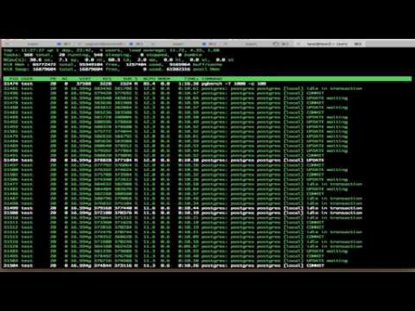

# Monitoring

[$<]

Let’s talk about monitoring in two parts

* Diagnostic
	* What are we asking the database?
	* How is it being answered?
	* Is something broken?

* Production Monitoring and Alerting
	* Disk Utilization
	* CPU over time
	* Growth (data, query)

[>$]

***

# Diagnostic Monitoring

[$<]

* “Find the issue”
* Typically, you’re looking for some specific bottleneck or problem 
* Usually looking for hard to pinpoint, point-in-time data

* Data sources
	* Hardware metrics
	* OS metrics
	* PostgreSQL catalogs
	* PostgreSQL Logs

* Workflow oriented

[>$]

***

# Production Monitoring & Alerting

[$<]

* Monitoring trends
* Alarming on thresholds and error conditions
* Emergency response 

* Data sources
	* Hardware metrics
	* OS metrics
	* PostgreSQL catalogs
	* PostgreSQL Logs

* Trend oriented

[>$]

***

# Hardware / OS Metrics

[$<]

* OS tools monitor postgres well

* Keep a few things in mind
	* There are many processes that make up a running instance
	* PostgreSQL uses shared memory, so simply adding all memory usage up is misleading

[>$]

((

People tend to add-up all of the memory that they see in a ps or top listing.  This is misleading, Linux shows all of them as having that much memory, BUT they are attached to the SAME memory segment.  It's the same block of memory being shared.  There are some differences ( work_mem, maintenance_work_mem, etc… ) that can show as variable memory size.

))

***

# Standard OS Tools

[$<]

* ps
* top
* Task Manager
* vmstat
* iostat
* gdb

[>$]

***

# ps

[$<]	

	$ ps aux | grep postgres
	postgres  6197  0.0  0.7 286708 14312 ?        S    20:23   0:00 /opt/postgresql/pg95/bin/postgres -D /opt/postgresql/pg95/data
	postgres  6199  0.0  0.0 286708  1484 ?        Ss   20:23   0:00 postgres: checkpointer process
	postgres  6200  0.0  0.1 286708  2432 ?        Ss   20:23   0:00 postgres: writer process
	postgres  6201  0.0  0.0 286708  1416 ?        Ss   20:23   0:00 postgres: wal writer process
	postgres  6202  0.0  0.1 287000  2152 ?        Ss   20:23   0:00 postgres: autovacuum launcher process
	postgres  6203  0.0  0.0 141692  1368 ?        Ss   20:23   0:00 postgres: stats collector process
	postgres  6328  0.0  0.2 287532  4608 ?        Ss   20:55   0:00 postgres: postgres postgres [local] SELECT
	postgres  6357  0.0  0.1 287532  3164 ?        Ss   20:56   0:00 postgres: postgres postgres [local] idle
	
* Postmaster
		
		“-D” flag points to data directory

* Utility Processes

		Update process titles to reflect their purpose

* Per-User backend processes

		Each connection’s server-side process

[>$]

***

# ps

[$<]

	$ ps aux | grep postgres

* Postmaster
	* “-D” flag points to data directory

			postgres  6197  0.0  0.7 286708 14312 ?        S    20:23   0:00 /opt/postgresql/pg95/bin/postgres -D /opt/postgresql/pg95/data

* Utility Processes
	* Update process titles to reflect their purpose

			postgres  6199  0.0  0.0 286708  1484 ?        Ss   20:23   0:00 postgres: checkpointer process
			postgres  6200  0.0  0.1 286708  2432 ?        Ss   20:23   0:00 postgres: writer process
			postgres  6201  0.0  0.0 286708  1416 ?        Ss   20:23   0:00 postgres: wal writer process
			postgres  6202  0.0  0.1 287000  2152 ?        Ss   20:23   0:00 postgres: autovacuum launcher process
			postgres  6203  0.0  0.0 141692  1368 ?        Ss   20:23   0:00 postgres: stats collector process

* Per-User backend processes
	* Each connection’s server-side process

			postgres  6328  0.0  0.2 287532  4608 ?        Ss   20:55   0:00 postgres: postgres postgres [local] SELECT
			postgres  6357  0.0  0.1 287532  3164 ?        Ss   20:56   0:00 postgres: postgres postgres [local] idle

[>$]

***

# ps - - Monitoring Activity

[$<]

	$ ps aux | grep postgres:
	postgres      8583  1.1  0.0 17400292 8908 ?       Ss   17:20   0:00 postgres: postgres postgres [local] UPDATE waiting
	postgres      8584  1.5  0.0 17400292 10268 ?      Ss   17:20   0:00 postgres: postgres postgres [local] UPDATE waiting
	postgres      8585  0.6  0.0 17400292 7932 ?       Ss   17:20   0:00 postgres: postgres postgres [local] UPDATE waiting
	postgres      8586  1.0  0.0 17400292 8332 ?       Ds   17:20   0:00 postgres: postgres postgres [local] COMMIT
	postgres      8587  1.0  0.0 17400292 8864 ?       Ss   17:20   0:00 postgres: postgres postgres [local] UPDATE waiting
	postgres      8588  0.6  0.0 17400292 8176 ?       Ss   17:20   0:00 postgres: postgres postgres [local] UPDATE waiting
	postgres      8589  0.5  0.0 17400292 7648 ?       Ss   17:20   0:00 postgres: postgres postgres [local] UPDATE waiting
	postgres      8590  1.1  0.0 17400296 8936 ?       Ss   17:20   0:00 postgres: postgres postgres [local] UPDATE waiting
	postgres      8591  1.0  0.0 17400296 8700 ?       Ss   17:20   0:00 postgres: postgres postgres [local] UPDATE waiting
	postgres      8592  1.0  0.0 17400296 7672 ?       Ss   17:20   0:00 postgres: postgres postgres [local] UPDATE waiting

* Postgres ‘worker’ backends update their process titles
	* process name: database user [client] statement waiting
		* The waiting string only appears when the client is blocked
		* This corresponds to the waiting column on pg_stat_activity

[>$]

***

# top

[$<]

* Monitors ‘top’ processes on a system

* Sortable by [almost] any column

* Default sorts by CPU % (descending)

* Differs by OS
	* OSX top vs. Linux top, etc...

			$ top
			top - 15:55:01 up 62 days, 16:27,  5 users,  load average: 0.64, 1.00, 1.07
			Tasks: 747 total,   2 running, 745 sleeping,   0 stopped,   0 zombie
			Cpu(s):  1.1%us,  0.2%sy,  0.0%ni, 98.6%id,  0.0%wa,  0.0%hi,  0.0%si,  0.0%st
			Mem:  264495720k total, 255151240k used,  9344480k free,   283560k buffers
			Swap:  2097144k total,     2160k used,  2094984k free, 245856152k cached
			
			  PID USER      PR  NI  VIRT  RES  SHR S %CPU %MEM    TIME+  COMMAND
			 7744 postgres  20   0 4370m 312m 305m S  3.6  0.1   0:00.88 postgres
			 7747 postgres  20   0 4370m 372m 365m S  3.3  0.1   0:00.94 postgres
			 7720 postgres  20   0 4369m 228m 221m S  3.0  0.1   0:00.61 postgres   
 
[>$]

***

# top

[$<]

* CPU
	* Postgres lives in user-space
	* %us 
* Disk
	* %wa column refers to ‘wait’
	* If high, typically refers to disk waits
	* Could refer to network wait
	* use vmstat and iostat to drill-in further
* Memory
	* Linux uses all available memory for disk cache
	* Look at used swap instead
* 

		$ top
		top - 15:55:01 up 62 days, 16:27,  5 users,  load average: 0.64, 1.00, 1.07
		Tasks: 747 total,   2 running, 745 sleeping,   0 stopped,   0 zombie
		Cpu(s):  1.1%us,  0.2%sy,  0.0%ni, 98.6%id,  0.0%wa,  0.0%hi,  0.0%si,  0.0%st
		Mem:  264495720k total, 255151240k used,  9344480k free,   283560k buffers
		Swap:  2097144k total,     2160k used,  2094984k free, 245856152k cached
		
		  PID USER      PR  NI  VIRT  RES  SHR S %CPU %MEM    TIME+  COMMAND
		 7744 postgres  20   0 4370m 312m 305m S  3.6  0.1   0:00.88 postgres
		 7747 postgres  20   0 4370m 372m 365m S  3.3  0.1   0:00.94 postgres
		 7720 postgres  20   0 4369m 228m 221m S  3.0  0.1   0:00.61 postgres   

[>$]

***

# top - Keyboard Shortcuts

[$<]

The following keyboard shortcuts can be accessed by pressing the noted key after top is running:

* c
	* Show the command string (shows the statement running)
* u
	* You will be prompted for a username, top will only show processes belonging to this user 
* 1  ( Push the number ‘1’ (no modifier key) )
	* Drill down to per-CPU utilization 
* d
	* You will be prompted to enter a delay (floating point number) in seconds
	* This adjusts the refresh rate of ‘top’ (default = 3.0 seconds)

	

[>$]

***

# CPU / Memory

[$<]

	$ vmstat 5
	procs -----------memory---------- ---swap-- -----io---- -system-- ----cpu----
	 r  b   swpd   free   buff  cache   si   so    bi    bo   in   cs us sy id wa
	 1  0 301288 282508 933072 553808    0    1    91    42    9  132  3  2 91  4
	 0  0 301288 283208 933080 552764    0    0     0    54 1703 2344  3  1 93  3
	 0  0 301288 271700 933080 565156    0    0     0     0 1668 2743  6  3 90  0
	 0  0 301288 273884 933088 562240    0    0     0    13 1708 2802  7  4 89  1
	 1  0 301288 277496 933132 570112    0    0     0   242 2494 3833 17  3 75  5
	 0  0 301288 300892 933140 557428    0    0     1   206 1435 1735  4  1 93  1
	 0  0 301288 309296 933148 556532    0    0     0    66 1147 1443  6  1 92  1
	 2  0 301288 301312 933156 562272    0    0     0     8 2003 2851  8  2 89  1

[>$]

***

# I/O

[$<]

	$ iostat -dx 5
	Linux 2.6.38-11-generic (jim-HP-620) 	09/15/2011 	_x86_64_	(2 CPU)
	 
	Device:         rrqm/s   wrqm/s     r/s     w/s    rkB/s    wkB/s avgrq-sz avgqu-sz   await r_await w_await  svctm  %util
	sda               6.95    16.72   29.08    4.23   181.90    83.77    15.95     1.11   33.42    3.25  240.74   2.32   7.74
	sda               0.00     0.00    0.00    2.40     0.00     9.60     8.00     0.02    8.33    0.00    8.33   8.33   2.00
	sda               0.00     0.00    0.00   12.60     0.00    50.40     8.00     0.18   14.29    0.00   14.29   3.65   4.60
	sda               0.00     0.00    0.00    3.40     0.00    13.60     8.00     0.03    7.65    0.00    7.65   4.12   1.40
	sda               0.00     0.60    0.00    7.20     0.00    29.60     8.22     0.12   16.67    0.00   16.67   6.39   4.60
	sda               0.00     0.00    0.00    0.00     0.00     0.00     0.00     0.00    0.00    0.00    0.00   0.00   0.00

[>$]

***

# GDB

[$<]

	$ sudo gdb –pid=19363
	(gdb) bt
	#0  0x00007f65d18d5fa0 in __poll_nocancel () at ../sysdeps/unix/syscall-template.S:81
	#1  0x000000000060f0bc in WaitLatchOrSocket ()
	#2  0x00000000006cf52b in pg_sleep ()
	#3  0x000000000058a9a2 in ExecMakeFunctionResultNoSets ()
	#4  0x000000000059001d in ExecProject ()
	#5  0x00000000005a10d2 in ExecResult ()
	#6  0x00000000005899c8 in ExecProcNode ()
	#7  0x0000000000586fb0 in standard_ExecutorRun ()
	#8  0x000000000066df38 in PortalRunSelect ()
	#9  0x000000000066f2df in PortalRun ()
	#10 0x000000000066d055 in PostgresMain ()
	#11 0x0000000000460322 in ServerLoop ()
	#12 0x000000000061f121 in PostmasterMain ()
	#13 0x0000000000460eaa in main ()

[>$]

***

# Database Metrics

[$<]

* So far been looking at how the database interfaces with the OS

* We need to drill into the database in order to see what’s going on
	* Finding performance issues
	* Tuning
	* Making architectural adjustments
	* Etc…

* Using system catalog tables and views it’s possible to look down to the table level

[>$]

***

#  Runtime Database Monitoring

[$<]

* pg_stat_activity           
* pg_stat_all_tables / pg_stat_user_tables
* pg_stat_all_indexes / pg_stat_user_indexes                
* pg_stat_archiver           
* pg_stat_bgwriter           
* pg_stat_database           
* pg_stat_database_conflicts 
* pg_stat_replication        
* pg_stat_sys_indexes        
* pg_stat_sys_tables         
* pg_stat_user_functions  
* pg_stat_xact_all_tables    
* pg_stat_xact_sys_tables    
* pg_stat_xact_user_functions
* pg_stat_xact_user_tables   
* pg_statio_all_indexes      
* pg_statio_all_sequences    
* pg_statio_all_tables       
* pg_statio_sys_indexes      
* pg_statio_sys_sequences    
* pg_statio_sys_tables       
    
[>$]

***

#  Query Monitoring

[$<]   
 
Monitoring current activity on the system ( pg_stat_activity)
 
	postgres=# \x
	Expanded display is on.
	postgres=# SELECT * FROM pg_stat_activity;
	-[ RECORD 1 ]----+--------------------------------
	 datid            | 12163                           
	 datname          | postgres                        
	 pid              | 15405                           
	 usesysid         | 10                              
	 usename          | jim                             
	 application_name | psql                            
	 client_addr      |                                 
	 client_hostname  |                                 
	 client_port      | -1                              
	 backend_start    | 2014-08-29 15:18:41.001531-04   
	 xact_start       | 2014-08-29 15:19:35.369844-04   
	 query_start      | 2014-08-29 15:19:35.369844-04   
	 state_change     | 2014-08-29 15:19:35.369848-04   
	 waiting          | f                               
	 state            | active                          
	 backend_xid      |                                 
	 backend_xmin     | 8368346                         
	 query            | SELECT * FROM pg_stat_activity; 

[>$]

***

#  Query Monitoring

[$<] 
           
	postgres=# select now() - query_start as runtime, pid, usename, state, waiting, query::varchar(50) from pg_stat_activity limit 25;
	     runtime      | pid  | usename  |        state        | waiting |                       query
	------------------+------+----------+---------------------+---------+----------------------------------------------------
	 -00:00:00.000292 | 1353 | postgres | idle in transaction | f       | SELECT abalance FROM pgbench_accounts WHERE aid =
	 00:00:00.000059  | 1354 | postgres | active              | f       | END;
	 00:00:00.000057  | 1355 | postgres | active              | f       | END;
	 00:00:00.002546  | 1356 | postgres | active              | t       | UPDATE pgbench_branches SET bbalance = bbalance +
	 -00:00:00.000303 | 1357 | postgres | idle in transaction | f       | BEGIN;
	 -00:00:00.000308 | 1358 | postgres | active              | f       | END;
	 00:00:00.006927  | 1359 | postgres | active              | t       | UPDATE pgbench_tellers SET tbalance = tbalance + 2
	 -00:00:00.000318 | 1360 | postgres | idle in transaction | f       | BEGIN;
	 -00:00:00.000327 | 1361 | postgres | idle in transaction | f       | SELECT abalance FROM pgbench_accounts WHERE aid =
	 -00:00:00.000333 | 1362 | postgres | idle in transaction | f       | INSERT INTO pgbench_history (tid, bid, aid, delta,
	 00:00:00.000037  | 1363 | postgres | active              | f       | END;
	 -00:00:00.000332 | 1364 | postgres | idle in transaction | f       | INSERT INTO pgbench_history (tid, bid, aid, delta,
	 -00:00:00.000003 | 1365 | postgres | active              | f       | END;
	 00:00:00.000552  | 1366 | postgres | active              | t       | UPDATE pgbench_branches SET bbalance = bbalance +
	 -00:00:00.000339 | 1367 | postgres | idle in transaction | f       | INSERT INTO pgbench_history (tid, bid, aid, delta,
	 -00:00:00.000345 | 1368 | postgres | idle in transaction | f       | UPDATE pgbench_tellers SET tbalance = tbalance + -
	 -00:00:00.000351 | 1369 | postgres | active              | f       | END;
	 -00:00:00.000357 | 1370 | postgres | idle in transaction | f       | INSERT INTO pgbench_history (tid, bid, aid, delta,
	 -00:00:00.000362 | 1371 | postgres | active              | f       | END;
	 -00:00:00.000369 | 1372 | postgres | idle in transaction | f       | UPDATE pgbench_tellers SET tbalance = tbalance + 1
	 -00:00:00.00038  | 1373 | postgres | idle in transaction | f       | BEGIN;
	 -00:00:00.000396 | 1374 | postgres | idle in transaction | f       | BEGIN;
	 -00:00:00.000404 | 1375 | postgres | idle in transaction | f       | BEGIN;
	 00:00:00.000505  | 1376 | postgres | active              | t       | UPDATE pgbench_branches SET bbalance = bbalance +
	 -00:00:00.000417 | 1377 | postgres | idle in transaction | f       | INSERT INTO pgbench_history (tid, bid, aid, delta,
	(25 rows)

[>$]

***

#  State Monitoring

[$<]

The state field shows whether or not we are actively processing something:

* active
	* query is currently active in the database
* idle
	* query is the most recently executed query, this connecting is not processing
* idle in transaction
	* query was the last executed statement, but, this connection is currently in a transaction

			postgres=# select state, count(*) from pg_stat_activity 
			postgres-#  group by state 
			postgres-# order by count desc;
			        state        | count
			---------------------+-------
			 active              |    75
			 idle in transaction |    26
			(2 rows)

[>$]

***

#  Connection Monitoring

[$<]

Each row in pg_stat_activity represents a client connected to the server:

	postgres=# select count(*) from pg_stat_activity ;
	 count
	-------
	   101
	(1 row)
	
	postgres=#

PostgreSQL timestamp math can be used:

	postgres=# select pid, now() - backend_start as connect_time
	  FROM pg_stat_activity
	ORDER BY connect_time DESC;
	 pid  |  connect_time
	------+-----------------
	 1486 | 00:18:57.122666
	 1845 | 00:02:45.313578
	 1846 | 00:02:45.309487
	 1847 | 00:02:45.305412
	 1848 | 00:02:45.301577
	 1849 | 00:02:45.297883
	 1850 | 00:02:45.294258
	 1851 | 00:02:45.290639
	 1852 | 00:02:45.287113
	 1853 | 00:02:45.283697
	 1854 | 00:02:45.280263

* backend_start
	* When the server process started
	* (when the connection was made)
* xact_start
	* When the current transaction started
* query_start
	* When the current query started
* state_change
	* When the current state started	
* pid
	* The pid of the server process corresponding to your connection

[>$]

***

#  Connection Monitoring

[$<]

In addition to the state, we have waiting.  Lock contention is typically seen:

	WHERE state = ‘active’ AND waiting = true

	postgres=# select pid, state, waiting, query from pg_stat_activity where state='active' and waiting=true;
	 pid  | state  | waiting |                                  query
	------+--------+---------+-------------------------------------------------------------------------
	 1353 | active | t       | UPDATE pgbench_branches SET bbalance = bbalance + -4905 WHERE bid = 18;
	 1365 | active | t       | UPDATE pgbench_branches SET bbalance = bbalance + -1336 WHERE bid = 27;
	 1368 | active | t       | UPDATE pgbench_branches SET bbalance = bbalance + 1941 WHERE bid = 73;
	 1373 | active | t       | UPDATE pgbench_branches SET bbalance = bbalance + 1571 WHERE bid = 89;
	 1375 | active | t       | UPDATE pgbench_branches SET bbalance = bbalance + -1704 WHERE bid = 60;
	 1379 | active | t       | UPDATE pgbench_branches SET bbalance = bbalance + -756 WHERE bid = 11;
	 1381 | active | t       | UPDATE pgbench_branches SET bbalance = bbalance + 3361 WHERE bid = 73;
	 1385 | active | t       | UPDATE pgbench_tellers SET tbalance = tbalance + -3924 WHERE tid = 194;
	 1387 | active | t       | UPDATE pgbench_branches SET bbalance = bbalance + 4886 WHERE bid = 73;
	 1391 | active | t       | UPDATE pgbench_branches SET bbalance = bbalance + -1293 WHERE bid = 66;
	 1395 | active | t       | UPDATE pgbench_branches SET bbalance = bbalance + 4724 WHERE bid = 18;
	 1398 | active | t       | UPDATE pgbench_tellers SET tbalance = tbalance + -2138 WHERE tid = 776;
	 1403 | active | t       | UPDATE pgbench_tellers SET tbalance = tbalance + 2208 WHERE tid = 47;
	 1409 | active | t       | UPDATE pgbench_branches SET bbalance = bbalance + -2156 WHERE bid = 11;
	 1410 | active | t       | UPDATE pgbench_branches SET bbalance = bbalance + -2970 WHERE bid = 5;
	 1411 | active | t       | UPDATE pgbench_branches SET bbalance = bbalance + 1679 WHERE bid = 18;
	 1414 | active | t       | UPDATE pgbench_branches SET bbalance = bbalance + -131 WHERE bid = 7;
	 1416 | active | t       | UPDATE pgbench_branches SET bbalance = bbalance + 4587 WHERE bid = 77;
	 1434 | active | t       | UPDATE pgbench_tellers SET tbalance = tbalance + -4035 WHERE tid = 173;
	 1440 | active | t       | UPDATE pgbench_branches SET bbalance = bbalance + 3231 WHERE bid = 35;
	 1444 | active | t       | UPDATE pgbench_branches SET bbalance = bbalance + 1850 WHERE bid = 12;
	 1458 | active | t       | UPDATE pgbench_branches SET bbalance = bbalance + 294 WHERE bid = 49;
	(22 rows)

These statements are actively processing, but, are blocked by some other connection

[>$]

***

#  Monitoring Table Utilization

[$<]

	gnb=# \x
	Expanded display is on.
	gnb=# select * from pg_stat_user_tables;
	-[ RECORD 1 ]-----+------------------------------
	relid             | 63237
	schemaname        | public
	relname           | pgbench_branches
	seq_scan          | 4
	seq_tup_read      | 400
	idx_scan          | 0
	idx_tup_fetch     | 0
	n_tup_ins         | 100
	n_tup_upd         | 0
	n_tup_del         | 0
	n_tup_hot_upd     | 0
	n_live_tup        | 100
	n_dead_tup        | 0
	last_vacuum       |
	last_autovacuum   |
	last_analyze      |
	last_autoanalyze  | 2015-02-24 17:09:39.92162-05
	vacuum_count      | 0
	autovacuum_count  | 0
	analyze_count     | 0
	autoanalyze_count | 1

[>$]

***

#  Monitoring Table Utilization

[$<]

	gnb=# select relid, schemaname, relname, seq_scan, seq_tup_read, idx_scan, 
	gnb-# idx_tup_fetch, n_tup_ins, n_tup_upd, n_tup_del 
	gnb-# FROM pg_stat_user_tables;
	
	 relid | schemaname |     relname      | seq_scan | seq_tup_read | idx_scan | idx_tup_fetch | n_tup_ins | n_tup_upd | n_tup_del
	-------+------------+------------------+----------+--------------+----------+---------------+-----------+-----------+-----------
	 16387 | public     | pgbench_tellers  |      467 |       109500 |    27063 |         27063 |       250 |     27500 |         0
	 16393 | public     | pgbench_branches |    36791 |       687575 |        0 |             0 |        25 |     27500 |         0
	 16390 | public     | pgbench_accounts |        1 |      2500000 |    55000 |         55000 |   2500000 |     27500 |         0
	 16384 | public     | pgbench_history  |        0 |            0 |          |               |     27500 |         0 |         0
	
* Simple way to start monitoring data-flow and application behavior

* Combine columns to get ‘total reads’ and ‘total writes’
		
		SELECT (seq_scan + idx_scan) as “Total_Reads”, (n_tup_ins, n_tup_upd, n_tup_del) as “Total Writes”
 
* Sort by any of the stats (ORDER BY n_tup_del DESC)

* Tracking these metrics over time provides key stats
	* https://bitbucket.org/scott_mead/pgon
	* https://bitbucket.org/openscg/opencollector

[>$]

***

#  Monitoring - Contrib Modules

[$<]

These are typically enabled by default because of a small memory / cpu penalty
 
* pg_stat_statements
* pg_stat_plans
* Pgstattuple
* pg_buffercache
* pgrowlocks
* pgfreespacemap

[>$]

***

#  Contrib Modules

[$<]

	gnb=# \x
	gnb=# SELECT query, calls, total_time, rows, 
	               100.0 * shared_blks_hit /
	               nullif(shared_blks_hit + shared_blks_read,
	                                        0) AS hit_percent
	       FROM pg_stat_statements ORDER BY total_time DESC 
	
	-[RECORD 1]--------------------------------------------
	query       | UPDATE pgbench_branches SET bbalance =   
	            |   bbalance + ? WHERE bid = ?;
	calls       | 3000
	total_time  | 9609.00100000002
	rows        | 2836
	hit_percent | 99.9778970000200936

[>$]

***

#  Monitoring Packages

[$<]

* BigSQL Manager (BAM)
	* Real-Time metric collection and display
* Graphite / Grafana
	* Extremely popular metrics collection packages
* OpenCollector
	* Detailed collection of fine-resolution stats
	* Publishes to Graphite / Grafana
* Nagios
	* Focused on Alerts and Notification
	* check_postgres.pl scripts for integration
	* Can use pgsnmpd
* Zabbix Monitoring
	* Open Source monitoring, alerting, and trending
* DataDog / New Relic 
	* Cloud-based monitoring

[>$]

***

#  Diagnostic Monitoring

[$<]

Workflow based

* How many connections do we have ?

		ps aux | grep postgres: | wc -l 

* That’s a lot, Is there a traffic storm against the app ? 

* How many connections do we have ?

		ps aux | grep postgres: | wc -l 
* That’s not many, let’s see what they’re up to…	
		ps aux | grep postgres: 

* Examine the output
* What’s the state? 
* Let’s look in pg_stat_activity;
		
		select now() - query_start runtime, state, waiting, query FROM pg_stat_activity;

* Long Running queries?
* How is I/O doing?
* Lots of idle in transaction?
* Is the app having problems?
* Network issues?
* Lots of waiting = true?
* Let’s look at locks… 

		select * from pg_locks where granted = false;

[>$]

***

#  Production Monitoring

[$<]

* Focused on predicting the problem
* Collect metrics 24x7 and analyze them

* Alarm if postgres down 

* tail-n-mail - Daily count of WARNING / ERROR / FATAL messages in logs
* Alarm if slow running queries in logs

* Alarm if connection count = 250 connections
* Alarm if connection count = 80% of max

* 80% Disk Utilization = Yellow, 90% = Red
* If daily disk utilization has increased by more than 10%, throw warning

* Alarm If configuration files change (postgresql.conf, pg_hba.conf)

[>$]

***

#  Lab Exercise  1

[$<]

Query a pg_catalog statistics table, find the user table that receives the most updates in the gnb database.

[>$]

((

\d+ pg_stat_user_tables;

Select schemaname, relname, n_tup_upd 
   FROM pg_stat_user_tables 
   ORDER by n_tup_upd DESC;

Select schemaname, relname, n_tup_ins, n_tup_upd, n_tup_del,seq_scan, idx_scan
   FROM pg_stat_user_tables 
   ORDER by n_tup_upd DESC;

))

***

#  Lab Exercise  2

[$<]

Write a statement to view process id, database, user, state, runtime, and query string of the currently executing queries

* Hint: Look at the stat table that provides information about activity

[>$]

((

Select pid, datname, usename, state, now() - query_start as runtime, query
  FROM pg_stat_activity;

))

***

#  Lab Exercise  3

[$<]

* How would you kill all user processes that have been running an active query for 5 minutes or longer?
 
* Write a query to accomplish this
	* Hint: ( now () - query_start > '5 minutes'::interval )

[>$]

((

The point is to get discussion going about what the process is.  Some people may not have the SQL background for this slightly more complicated query.
 Really, they should be thinking
Look at the activity table, find active queries that have been running for 'now() - query_start > '5 minutes'::interval 
For each, pid, pass it to pg_terminate_backend(pid)
 
select pg_terminate_backend(pid) 
   FROM pg_stat_activity 
   WHERE now() - query_start > '5 minutes'::interval;
A more advanced example that allows logging is in the class notes

))

***

#  Lab Exercise  4

[$<]

The GNB system has been in production for 6 months.  Lately, performance has started to suffer a bit.  Enable the proper settings to accomplish the following:

* Monitor checkpoints
* Monitor all autovacuum
* Monitor all connect / disconnects
* Monitor all lock waits
* Monitor all temp file usage

[>$]

((

Edit postgresql.conf and set 
log_checkpoints=on
autovacuum_min_duration=0
log_connections=on
log_disconnections=on
log_lock_waits=on
log_temp_files=0
 
pg_ctl -D /data reload
 
Run pgbench -s 100 -c 20 -t 100 gnb
Watch the logs
 
))