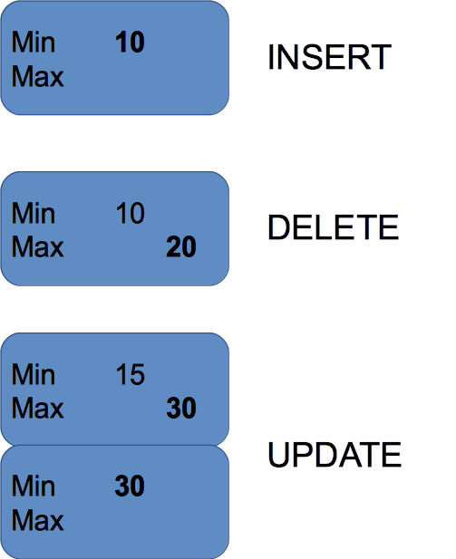
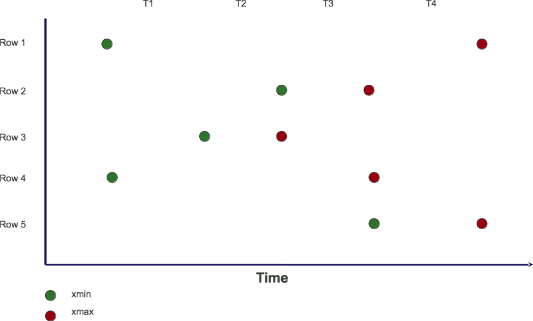
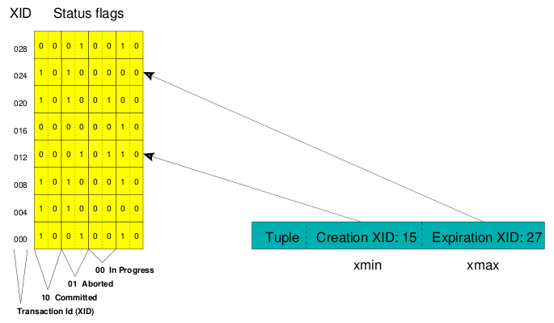

# What is MVCC?

[$<]

####Multiversion Concurrency Control
* Allows Postgres to offer high concurrency even during significant database read/write activity
* Readers never block writers, and writers never block readers
* Reduces locking requirements, but does not eliminate locking

[>$]

***

# MVCC Behavior

[$<]

* Visibility is driven by XID
* Tuples have an XMIN and XMAX 

[>$]

***

# Life of a Tuple

[$<]

[>$]

***

# Life of a Tuple

[$<]

[>$]

***

# XMIN

[$<]

	postgres=# DELETE FROM foo;
	DELETE 2
	postgres=# INSERT INTO foo VALUES (51);
	INSERT 0 1
	postgres=# SELECT xmin, xmax, * FROM foo;
	 xmin | xmax | f1 
	------+------+----
	 8531 |    0 | 51
	(1 row)

[>$]

***

# XMAX

[$<]

	postgres=# BEGIN;
	BEGIN
	postgres=# DELETE FROM foo;
	DELETE 1
	postgres=# SELECT xmin, xmax, * FROM foo;
	 xmin | xmax | f1 
	------+------+----
	(0 rows)
	
	postgres=# ROLLBACK;
	
	--------------------------------------------------------
	postgres=# SELECT xmin, xmax, * FROM foo;
	 xmin | xmax | f1 
	------+------+----
	 8531 | 8532 | 51
	(1 row)
	
[>$]

***

# Updates with XMIN and XMAX

[$<]

	postgres=# INSERT INTO foo VALUES (52);
	INSERT 0 1
	postgres=# BEGIN;
	BEGIN
	postgres=# UPDATE foo SET f1=53 WHERE f1 = 52;
	UPDATE 1
	postgres=# SELECT xmin, xmax, * FROM foo;
	 xmin | xmax | f1 
	------+------+----
	 8531 | 8532 | 51
	 8534 |    0 | 53
	(2 rows)
	
	--------------------------------------------------------
	postgres=# SELECT xmin, xmax, * FROM foo;
	 xmin | xmax | f1 
	------+------+----
	 8531 | 8532 | 51
	 8533 | 8534 | 52
	(2 rows)

[>$]

***

# Updates with XMIN and XMAX

[$<]

* Rollbacks mark the XID as aborted
* Sessions ignore aborted XIDs

[>$]

***

# CMIN

[$<]

	postgres=# DELETE FROM foo;
	DELETE 2
	postgres=# BEGIN;
	BEGIN
	postgres=# INSERT INTO foo VALUES (61);
	INSERT 0 1
	postgres=# INSERT INTO foo VALUES (62);
	INSERT 0 1
	postgres=# SELECT cmin, xmin, xmax, * FROM foo;
	 cmin | xmin | xmax | f1 
	------+------+------+----
	    0 | 8536 |    0 | 61
	    1 | 8536 |    0 | 62
	(2 rows)

[>$]

***

# DELETE with CMIN

[$<]

	postgres=# DECLARE foo_mvcc CURSOR FOR
	postgres-#  SELECT xmin, xmax, cmax, * FROM foo;
	DECLARE CURSOR
	postgres=# DELETE FROM foo;
	DELETE 2
	postgres=# SELECT cmin, xmin, xmax, * FROM foo;
	 cmin | xmin | xmax | f1 
	------+------+------+----
	(0 rows)
	
	postgres=# FETCH ALL FROM foo_mvcc;
	 xmin | xmax | cmax | f1 
	------+------+------+----
	 8536 | 8536 |    0 | 61
	 8536 | 8536 |    1 | 62
	(2 rows)
	
[>$]

***

# Looking on Disk

[$<]

	postgres=# TRUNCATE foo;
	TRUNCATE TABLE
	postgres=# INSERT INTO foo VALUES (71), (72);
	INSERT 0 2
	postgres=# SELECT ctid, xmin, xmax, * FROM foo;
	 ctid  | xmin | xmax | f1 
	-------+------+------+----
	 (0,1) | 8548 |    0 | 71
	 (0,2) | 8548 |    0 | 72
	(2 rows)
	
	postgres=# SELECT t_ctid, lp_flags, lp_off, t_xmin, t_xmax
	postgres-#   FROM heap_page_items(get_raw_page('foo', 0));
	 t_ctid | lp_flags | lp_off | t_xmin | t_xmax 
	--------+----------+--------+--------+--------
	 (0,1)  |        1 |   8160 |   8548 |      0
	 (0,2)  |        1 |   8128 |   8548 |      0
	(2 rows)

[>$]

***

# lp_flags values

[$<]

0 – Unused  
1 – Normal  
2 – Redirected  
3 – Dead  

[>$]

***

# lp_flags values

[$<]
