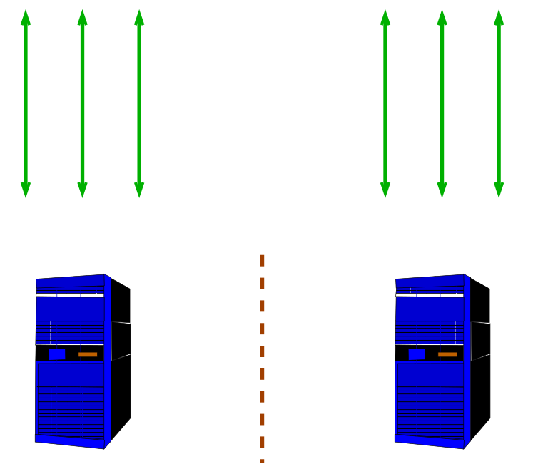

# Uses for Replication

[$<]

###Fail Over:

[>$]

***

# Uses for Replication

[$<]

###Load Balancing:

[>$]

***

# Uses for Replication

[$<]

###Data Warehousing:

[>$]

***

# Uses for Replication

[$<]

###Remote Servers:

[>$]

***

# Uses for Replication

[$<]

###Mobile Servers:

[>$]

***

# Solutions – Share Storage

[$<]

* No overhead
* No data loss on fail-over
* Slave cannot execute queries

[>$]

***

# Solutions – Continuous Archiving

[$<]

* No overhead on master
* Possible data loss on fail-over when using asynchronous
* Slaves can execute queries in PGSQL 9.0
* Synchronous available

[>$]

***

# Solutions – Slony

[$<]

* Triggers add overhead to the master
* Possible data loss on fail-over
* Replication possible even over slow links
* Slave can execute read-only queries
* Table-level granularity allows complex data partitioning configurations

[>$]

***

# Slony Cascading Slaves

[$<]

[>$]

***

# Slony Internals

[$<]

[>$]

***

# Slony - Multi-Slave

[$<]

[>$]

***

# Solutions – Bucardo

[$<]

* Similar to Slony eRServer, except multi-master with conflict resolution
* Conflict resolution rules are user-configurable

[>$]

***

# Solutions – PG Pool II

[$<]

* Automatically load-balances read queries
* Queries with non-deterministic behavior can cause inconsistency
* Allows parallel query execution on all nodes
* Also does connection pooling and query caching

[>$]

***

# Solutions – PG Pool II with Master/Slave Replication

[$<]

Master/slave replication avoids the problem of non-deterministic queries producing different results on different hosts

[>$]

***

# Solutions – PGCluster

[$<]

* High performance cost
* Still experimental

[>$]

***

# Solutions – Streaming

[$<]

* Changes are streamed to the standby, greatly reducing log shipping delays
* Standby can accept read-only queries
* No overhead on master
* Possible data loss on fail-over when using asynchronous

[>$]

***

# How Does Streaming Replication Work?

[$<]

* Changes are streamed to the standby, greatly reducing log shipping delays
* Standby can accept read-only queries
* No overhead on master
* Possible data loss on fail-over when using asynchronous

[>$]

***

# Live Streaming Replication

[$<]

[>$]

***

# Enable Streaming to the Standby

[$<]

Enable the proper WAL contents:

	wal_level = hot_standby

Retain WAL files needed by the standby:

	wal_keep_segments = 50

Enable the ability to stream WAL to the standby:

	max_wal_senders = 1

[>$]

***

# Enable Standby Connection Permissions

[$<]

Add permission for replication to pg_hba.conf:

	host  replication  all  127.0.0.1/32  trust

Start the primary server:
	
	pg_ctl -l /u/pg/data/server.log start

[>$]

***

# Perform a File System Backup

[$<]

Start psql and issue:

	SELECT pg_start_backup(’testing’);

Copy the database /u/pg/data to a new directory, /u/pg/data2:

	cp -p -R /u/pg/data /u/pg/data2

Dash-p preserves ownership. The copy is inconsistent, but that is okay (WAL replay will correct that). Signal the backup is complete from psql:

	SELECT pg_stop_backup();

[>$]

***

# Configure the Standby

[$<]

Remove /data2/postmaster.pid so the standby server does not see the primary server’s pid as its own:

	rm /u/pg/data2/postmaster.pid

(This is only necessary because we are testing with the primary and slave on the same computer.)

Edit postgresql.conf on the standby and change the port to 5433:

	port = 5433

Enable hot standby in postgresql.conf:

	hot_standby = on

[>$]

***

# Configure the Standby 

[$<]

Create recovery.conf:

	cp /u/pg/share/recovery.conf.sample /u/pg/data2/recovery.conf

Enable streaming in recovery.conf:

	standby_mode = ’on’
	primary_conninfo = ’host=localhost port=5432’

Start the standby server:

	PGDATA=/u/pg/data2 pg_ctl -l /u/pg/data2/server.log start

[>$]

***

# Configure the Standby 

[$<]

	$ psql -p 5432 -c ’CREATE TABLE streamtest(x int)’ postgres
	$ psql -p 5433 -c ’\d’ postgres
	List of relations
	 Schema |    Name    |  Type | Owner
	--------+------------+-------+----------
	 public | streamtest | table | postgres
	(1 row)
	$ psql -p 5432 -c ’INSERT INTO streamtest VALUES (1)’ postgres
	INSERT 0 1
	$ psql -p 5433 -c ’INSERT INTO streamtest VALUES (1)’ postgres
	ERROR: cannot execute INSERT in a read-only transaction

[>$]

***

# Backups -Configuration Parameters 

[$<]

	archive_mode = on
	archive_command = ‘<something>’
	wal_level = archive
archive is minimum, we recommend ‘hot_standby’

[>$]

***

# Log Shipping - Configuration Parameters 

[$<]

postgresql.conf

	archive_mode = on
	archive_command = ‘<something>’
	wal_level = archive

archive is minimum, we recommend ‘hot_standby’

[>$]

***

# Lab Exercise 1

[$<]

* Create a new cluster
* Create a new table
* Setup Streaming Replication to a second cluster
* Create another table

[>$]